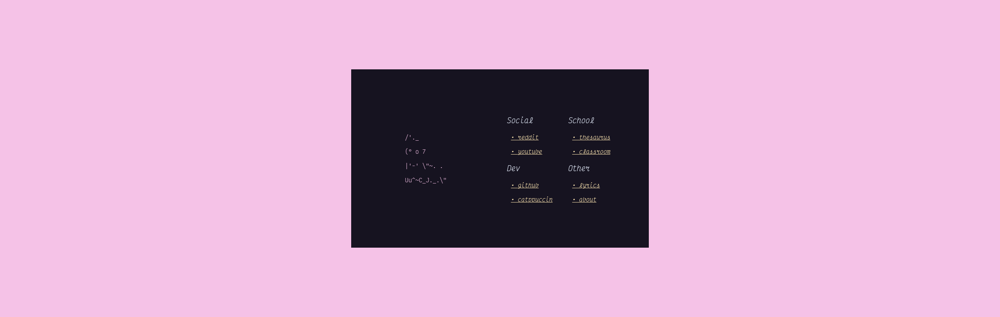

# startpage
catppuccin color scheme personal startpage

### usage
- go to https://okklol.github.io/startpage/ or clone locally to use the custom font (VictorMono Cursive Font)

### dependencies
- VictorMono Cursive Font (https://rubjo.github.io/victor-mono/)

### installation

#### on arch
```
yay -S nerd-fonts-victor-mono
git clone https://github.com/okklol/startpage.git
```
- download NewTabOverride (https://addons.mozilla.org/de/firefox/addon/new-tab-override/)
- set options to "local file" and choose the ```index.html``` file

#### on other systems
- download the font
- ```git clone https://github.com/okklol/startpage.git```
- ownload NewTabOverride (https://addons.mozilla.org/de/firefox/addon/new-tab-override/)
- set options to "local file" and choose the ```index.html``` file
